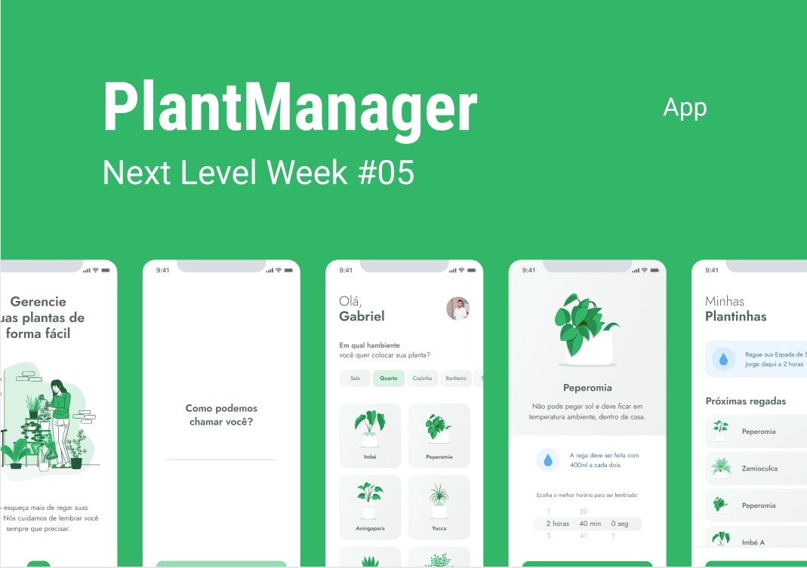

<h1 align="center">
    
</h1>

<h1>Plantmanager</h1>

App em ReactNative desenvolvido na semana NextLevelWeek da [@Rocketseat](https://rocketseat.com.br/) 

<h3>→ Technologies</h3>

* [ReactNative](https://reactnative.dev/)
* [Expo](https://expo.io/)
* [Typescript](https://www.typescriptlang.org/ )

<h3>→ Project</h3>

Aplicativo que salva o horario e notifica o usuário para regar suas plantas 

#UI - Figma:

  

